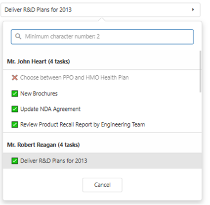

1. DevExtreme
Поиск есть
Выбор значения из заранее созданного списка или пустое значение есть
Возможность запретить выбор пустого значения есть
Возможность пользователю сбросить значение есть
Возможность пользователю перейти к просмотру выбранного значения нет
Компонент имеет следующий вид
 
https://js.devexpress.com/React/ - ссылка на сайт
Имеется пробный период, но для коммерции необходима платная лицензия, цены приведены ниже
 
2. Material UI
Поиск есть
Выбор значения из заранее созданного списка или пустое значение есть
Возможность запретить выбор пустого значения есть
Возможность пользователю сбросить значение есть
Проверка на обязательное значение есть
Возможность пользователю перейти к просмотру выбранного значения есть
Компонент имеет следующий вид
 
https://mui.com/material-ui/react-modal/ - ссылка на сайт
Использование для коммерции бесплатно. 
