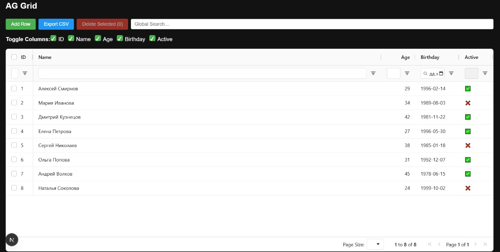
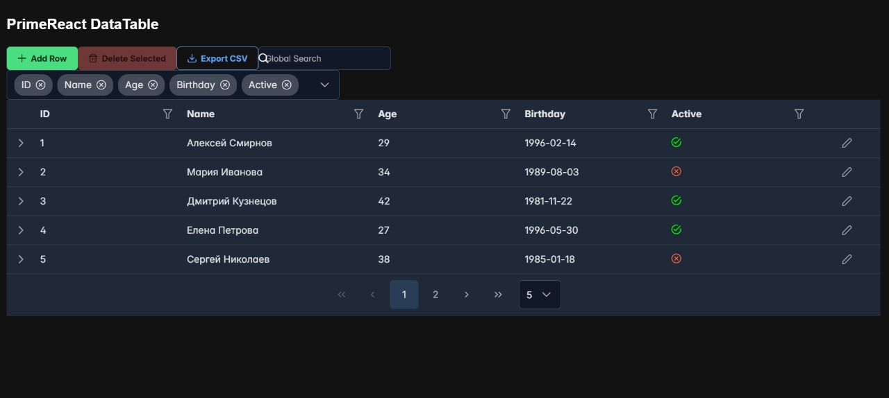
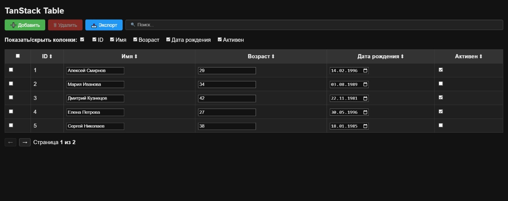

# Отчет: Поиск библиотеки для компонента «Таблица» №3

**Задача:**  
Найти React-библиотеки для компонента «Таблица», сравнить с AG Grid и MUI X DataGrid, и оценить по ряду требований.

---

## 1. AG Grid Community / Enterprise

- **Лицензия:**  
  - Community – MIT (бесплатно, коммерческое использование разрешено)  
  - Enterprise – коммерческая лицензия (от \$999/разработчик/год)
- **Сайт / репозиторий:**  
  - https://www.ag-grid.com/  
  - https://github.com/ag-grid/ag-grid
- **Реализуемые требования:**  
  - ✅ Изменение размера столбцов  
  - ✅ Скрытие/показ колонок  
  - ✅ Сортировка по любому столбцу  
  - ✅ Глобальный поиск (Quick Filter)  
  - ✅ Пагинация + выбор размера страницы  
  - ✅ Дерево (Row Grouping / Tree Data)  
  - ✅ Фильтрация (разнообразные встроенные фильтры)  
  - 🟠 Мультифильтрация (AND/OR) – только в Enterprise  
  - 🟠 Редактирование (текст, boolean, date как строка) – расширенные редакторы в Enterprise  
  - ✅ Добавление строк (через API)  
  - 🟠 Excel-экспорт – CSV в Community, полноценный Excel в Enterprise  

<aside>  
💡 Пример: страница `/table/ag-grid`.  
</aside>

---

## 2. MUI X React DataGrid

- **Лицензия:** MIT (DataGrid)  
- **Сайт / репозиторий:**  
  - https://mui.com/x/react-data-grid/  
  - https://github.com/mui/material-ui-x
- **Стоимость:**  
  - DataGrid – бесплатно (MIT)  
  - Pro / Premium – от \$49/рабочее место/месяц
- **Реализуемые требования:**  
  - ✅ Изменение размера  
  - ✅ Скрытие/показ колонок  
  - ✅ Сортировка  
  - ✅ Глобальный поиск (Quick Filter)  
  - ✅ Пагинация + выбор размера страницы  
  - 🟠 Дерево (Tree Data) – только в Pro  
  - 🟠 Расширенная фильтрация, мультифильтрация – в Pro  
  - ✅ Редактирование (текст, число, чекбокс, кастомный date-picker)  
  - ✅ Добавление строк (через state)  
  - 🟠 Excel-экспорт – в Pro  

<aside>  
💡 Пример: страница `/table/mui`.  
</aside>

---

## 3. PrimeReact DataTable

- **Лицензия:** MIT (бесплатно)  
- **Сайт / репозиторий:**  
  - https://primereact.org/datatable/ 
  - https://github.com/primefaces/primereact
- **Реализуемые требования:**  
  - ✅ Изменение размера  
  - ✅ Скрытие/показ колонок (через MultiSelect)  
  - ✅ Сортировка  
  - ✅ Глобальный и колонковый поиск  
  - ✅ Пагинация + выбор размера страницы  
  - 🟡 Расширение строк вместо полноценного дерева  
  - ✅ Фильтрация + мультифильтрация (FilterMatchMode)  
  - ✅ Редактирование (текст, число, дата, чекбокс)  
  - ✅ Добавление строк  
  - ✅ CSV / Excel-экспорт  

<aside>  
💡 Пример: страница `/table/primereact`.  
</aside>

---

## 4. TanStack Table (v8)

- **Лицензия:** MIT (бесплатно)  
- **Сайт / репозиторий:**  
  - https://tanstack.com/table/v8  
  - https://github.com/TanStack/table
- **Реализуемые требования:**  
  - ✅ Скрытие/показ колонок (columnVisibility)  
  - ✅ Сортировка  
  - ✅ Глобальный поиск + колонковая фильтрация  
  - ✅ Пагинация + выбор размера страницы  
  - ✅ Редактирование через кастомные cell-рендереры  
  - ✅ Добавление/удаление строк (через state)  
  - 🟢 Изменение размера – требует дополнительной реализации  
  - 🔴 Дерево (нет встроенной поддержки)  
  - 🔴 Excel-экспорт – реализуется вручную через CSV  

<aside>  
💡 Пример: страница `/table/tanstack`.  
</aside>

---

## Сравнительная таблица

| Функция                               | AG Grid C | AG Grid E | MUI DataGrid | MUI Pro | PrimeReact | TanStack Table |
|:--------------------------------------|:--------:|:--------:|:------------:|:-------:|:----------:|:--------------:|
| Изменение размера столбцов            | ✅       | ✅       | ✅           | ✅      | ✅         | 🟢 (кастом)    |
| Скрытие/показ колонок                 | ✅       | ✅       | ✅           | ✅      | ✅         | ✅             |
| Сортировка                            | ✅       | ✅       | ✅           | ✅      | ✅         | ✅             |
| Глобальный поиск                      | ✅       | ✅       | ✅           | ✅      | ✅         | ✅             |
| Пагинация + выбор размера страницы    | ✅       | ✅       | ✅           | ✅      | ✅         | ✅             |
| Дерево (Tree Data)                    | ✅       | ✅       | 🔴 (expander)| ✅      | 🔴 (expander)| 🔴             |
| Фильтрация                            | ✅       | ✅       | 🔴 (огранич.)| ✅      | ✅         | ✅             |
| Мультифильтрация (AND/OR)             | 🔴       | ✅       | ✅           | ✅      | ✅         | ✅             |
| Инлайн-редактирование                 | 🟠       | ✅       | ✅           | ✅      | ✅         | ✅             |
| Добавление/удаление строк             | ✅       | ✅       | ✅           | ✅      | ✅         | ✅             |
| Экспорт в Excel / CSV                 | 🔴 (CSV) | ✅ (Excel)| 🔴 (CSV)    | ✅      | ✅         | 🔴 (CSV)       |

---

## Вывод и рекомендации

1. **Полный «out-of-the-box» функционал** (дерево, мультифильтрация, Excel-экспорт):  
   – **AG Grid Enterprise** или **MUI DataGrid Pro**.  
2. **Бесплатный, но мощный** вариант с богатой фильтрацией и редакторами:  
   – **PrimeReact DataTable**.  
3. **Максимальная гибкость и контроль** при готовности добавить свою обвязку:  
   – **TanStack Table** (MIT), но придётся самостоятельно реализовать дерево и size-export.

---
